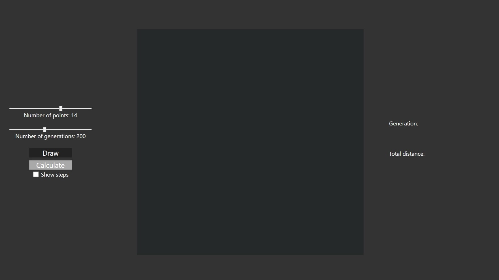
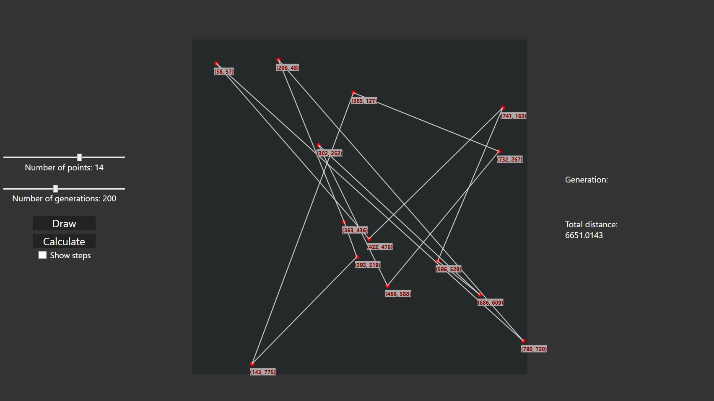
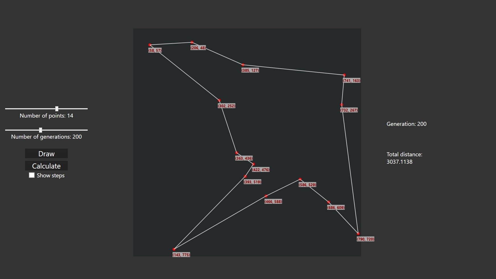

  <h1 align="center">📈 Traveling Salesman Problem</h1>

  

    The project implements genetic algorithm to solve the traveling salesman problem.
  

 

## About the project

  This is a small project made to practice some WPF features. The application implements a genetic algorithm that solves the traveling salesman problem.
  To visualize the operation of the algorithm, select the number of points to be generated randomly and connected by a random route. Then use the slider 
  to select the number of generations of the algorithm. After checking the checkbox, the changes in individual generations will be visualized. If the 
  result is not the shortest possible route, you can run the algorithm again.

## Built with
  [![WPFLogo][WPF]][WPF-url]
  [![CSharp][CSharpLogo]][CSharp-url]

[WPF]: https://img.shields.io/badge/WPF-5C2D91?style=for-the-badge&logo=.net&logoColor=white
[WPF-url]: https://learn.microsoft.com/pl-pl/dotnet/desktop/wpf/?view=netdesktop-6.0
[CSharpLogo]: https://img.shields.io/badge/C%23-239120?style=for-the-badge&logo=csharp&logoColor=white
[CSharp-url]: https://learn.microsoft.com/en-us/dotnet/csharp/

## Screenshots

  
  
  

